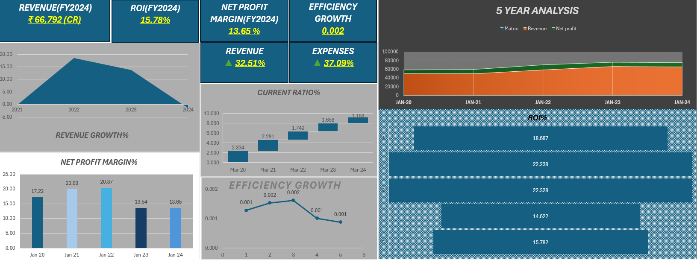
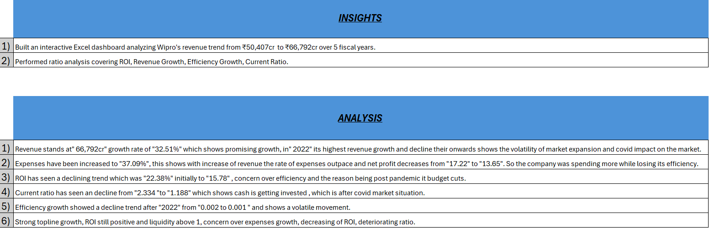

# Github
An independent financial analysis of Wipro Limited using 5 years of annual report data (FY2020–FY2024). Built an interactive Excel dashboard performing ratio analysis to evaluate profitability, efficiency, and liquidity trends.
Objective
To assess Wipro's financial health over a 5-year period and determine whether the stock represents a sound investment based on fundamental ratios — without relying on external analyst reports.
## Dashboard Preview

